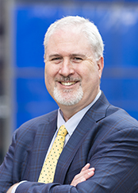
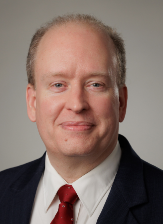

# AI for Health: Leveraging Artificial Intelligence to Revolutionize Healthcare (PSB 2026)

## Introduction

Artificial Intelligence (AI) is poised to transform healthcare, offering groundbreaking capabilities in disease diagnosis, treatment, drug discovery, and patient care. By improving access to health services, reducing costs, and addressing workforce shortages, AI can play a pivotal role in tackling global health challenges.

Successfully integrating AI into healthcare, however, requires careful consideration of regulatory frameworks, governance structures, data equity, and privacy protections. As interest in applying AI to healthcare grows, close collaboration between academia, clinical practitioners, and the healthcare industry becomes increasingly crucial to ensure that AI technologies are inclusive, equitable, and ethical.

This workshop will bring together AI researchers, clinicians, and industry experts to foster dialogues and insights that contribute to responsible AI development. Focus areas will include:

- AI for medical data analysis  
- Clinical decision support systems  
- Drug discovery  
- Personalized medicine  
- Digital health platforms  

All of these areas promise to reshape the future of health services.

---

## Schedule

<table>
  <tr>
    <td width="120">
     <!-- no imaging for introduction -->
    </td>
    <td>
      <strong>9:00 – 9:05 - Ruowang Li</strong> Cedars-Sinai Medical Center 
      Introduction
    </td>
  </tr>
  <tr>
    <td>
      
    </td>
    <td>
      <strong>9:05 – 9:30 — Evangelos Papalexakis</strong> 
      University of California, Riverside 
      <em>AI-driven latent structure discovery for health insights</em>
    </td>
  </tr>
  <tr>
    <td>
      
    </td>
    <td>
      <strong>9:30 – 9:55 — Rui Duan</strong> Harvard University 
      <em>Unsupervised aggregation of multiple learning algorithms</em>
    </td>
  </tr>
  <tr>
    <td>
      
    </td>
    <td>
      <strong>9:55 – 10:20 — Sean Mooney</strong> National Institutes of Health 
      <em>TBD</em>
    </td>
  </tr>
  <tr>
    <td>
      <!-- empty cell for break -->
    </td>
    <td>
      <strong>10:20 – 10:30</strong> 
      Break
    </td>
  </tr>
  <tr>
    <td>
      
    </td>
    <td>
      <strong>10:30 – 10:55 — Nicholas Tatonetti</strong> Cedars-Sinai Medical Center 
      <em>AI-driven discovery using real-world clinical data</em>
    </td>
  </tr>
  <tr>
    <td>
      
    </td>
    <td>
      <strong>10:55 – 11:20 — Marylyn Ritchie</strong> Medical University of South Carolina 
      <em>TBD</em>
    </td>
  </tr>
  <tr>
    <td>
      
    </td>
    <td>
      <strong>11:20 – 11:45 — Jason Moore</strong> Cedars-Sinai Medical Center 
      <em>Agentic AI approaches for biomedical research</em>
    </td>
  </tr>
  <tr>
    <td>
      <!-- empty cell for discussion -->
    </td>
    <td>
      <strong>11:45 – 12:00</strong> 
      Discussions and Q&amp;A
    </td>
  </tr>
</table>

---

## Organizers

### Ruowang Li, Ph.D.

Ruowang Li is an Assistant Professor in the Department of Computational Biomedicine at Cedars-Sinai Medical Center. His lab focuses on developing computational methods to extract knowledge from large-scale population-level data, such as biobank-linked electronic health record data. His research interests include multi-omics data integration, federated learning for patient data, genetic risk prediction, and genome–phenome associations.

---

### Tiffani Bright, Ph.D.

Tiffani Bright is an Assistant Professor of Computational Biomedicine at Cedars-Sinai and Co-Director of the Center for AI Research and Education. Her lab works to reduce bias in machine learning, ensuring clinical AI models treat all patients fairly. They enhance AutoML tools such as TPOT to automate bias detection and mitigation, making fair model development more scalable. Instead of traditional proxies like race, they design predictive models based on fairer metrics to promote equitable healthcare outcomes.

---

### Brian D. Davison, Ph.D.

Brian D. Davison is a Professor and Chair of the Department of Computer Science and Engineering at Lehigh University. He is a co-founder of Lehigh's Center for Catastrophe Modeling, a founding co-director of the interdisciplinary Master's Program in Data Science, and the founding director of Lehigh's undergraduate minor in data science. He serves as senior associate editor of the Association for Computing Machinery (ACM) journal *Transactions on Intelligent Systems and Technology* and associate editor for *Frontiers in Big Data*, Data Mining and Management Section. His research focuses on search, mining, recommendation, and classification problems in text and on the Web, as well as catastrophe modeling for natural disasters and health-related threats. Davison is an NSF Faculty Early CAREER award winner, and his research has been supported by NSF, NIH, DARPA, Microsoft, Amazon, and Sun Microsystems.

---

### Lifang He, Ph.D.

Lifang He is an Associate Professor in the Department of Computer Science and Engineering at Lehigh University and the Chair of the IEEE Computer Society Chapter at the Lehigh Valley Section. She received her Ph.D. in Computer Science and completed postdoctoral training at the University of Pennsylvania and Cornell’s medical schools. Dr. He has extensive expertise in developing advanced computational methods for biomedical research, including understanding disease mechanisms, diagnosis, prognosis, disease biomarkers, and disease pathways. Her research spans machine learning, computational medical imaging, AI for health, tensor computing, and multimodal analysis. She has published over 200 papers in peer-reviewed journals and conferences, and her work has been supported by NIH, NSF, ONR, and DOE.
